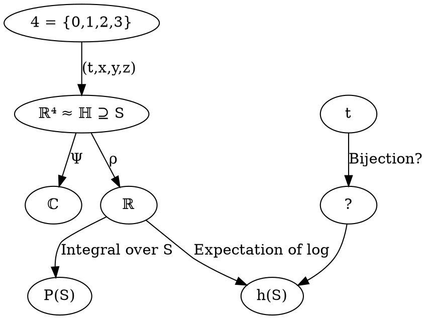
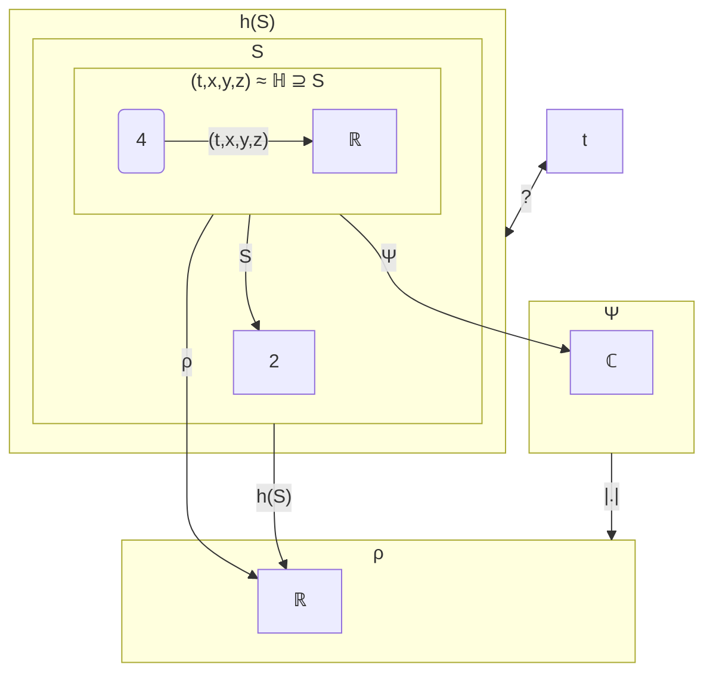

\href{https://www.youtube.com/watch?v=vgYQglmYU-8\&t=667s}{How Quantum Entanglement Creates Entropy}

  

Quantum Information Theory

  

\href{https://www.youtube.com/watch?v=ppFhkVZuYyc}{Landauer's principle, fluctuations \& the second law - Ben Schumacher}

  

\href{https://www.youtube.com/watch?v=LJiXTCbFtu0}{Harmonic Gestalt by Steven Lehar}

\end{undefined}

$P(S) = \int_{S}d\rho$
$h(S) = -\int_{R\in S}\log{P(R)}$ 

Entropia como a distância entre o sujeito e o objeto no fenômeno.

  

Quanto maior a entropia, maior o desconhecimento, mais micro-estados (variáveis desconhecidas) por macro-estado (variáveis conhecidas).

  

A visão entropica da dispersão de energia nada mais é que um movimento do conhecido ao desconhecido, contrapondo-se ao movimento em si (do futuro para o passado, atualização de potências). A segunda lei da termodinâmica permite diferenciar passado de futuro, ato de potência, é o que permite afirmar que o sujeito está mais perto do objeto no passado porque o que passou imutabiliza-se na dispersão do entrelaçamento quântico colapsando a função de onda e seu espaço de probabilidades no aqui e agora. Ato e potência existem como diferentes modos de ser para explicar mudanças como transformações de ser para ser, sem mudança do nada para o ser ou do ser para o nada. No momento que uma potência se atualiza, que a função de onda colapsa, parte do ser que era desconhecida se torna conhecida. Nesse momento a entropia, isto é, a distância entre sujeito e objeto diminui, mas nesse momento também, o que se tornou conhecido, tornou-se tal pelo seu entrelaçamento com a memória, portanto, percebemo-lo no passado. Outra palavra para este entrelaçamento é simplesmente interação, desta forma, o conceito de tempo, que é usualmente concebido simplesmente como um número para o movimento, pode ser visto, de um ponto de vista qualitativo como o conjunto dessas interações. Note que não é possível dar a este conjunto uma ordem canônica, já que como consequência da relatividade geral, toda ordem de eventos (que incluem interações) é relativa ao sujeito observador. Mas mesmo as interações sendo relativa ao observador, o conjunto delas existe e, pela segunda lei da termodinâmica, não diminui. Quantitativamente entropia como função do tempo é não decrescente, embora seja não decrescente de formas diferentes dependendo do observador. Porém, para todo observador, há motivos para acreditar que esta função seja seja

\end{undefined}

  

\begin{enumerate}

\item Contínua

\item Não constante

\end{enumerate}

\begin{undefined}

Por hora vamos postular que esta função $\displaystyle s( t)$ tenha essas propriedades, assim há um isomorfismo $\displaystyle s\leftrightarrow t$, o que mostra que a diferença entre ambos é apenas de escala, mas existem funções com essas características onde o valor da função é tangente ao 0. Por exemplo, se $\displaystyle t( s) =e^{s}$ ou $\displaystyle s( t) =\ln t$, não existe valor de $\displaystyle s$ para o qual $\displaystyle t=0$.
In Minkowiski Space $\displaystyle q\cdot p=q_{t} p_{t} -q_{\textcolor[rgb]{0.82,0.01,0.11}{x}\textcolor[rgb]{0.25,0.46,0.02}{y}\textcolor[rgb]{0.29,0.56,0.89}{z}} \cdot p_{\textcolor[rgb]{0.82,0.01,0.11}{x}\textcolor[rgb]{0.25,0.46,0.02}{y}\textcolor[rgb]{0.29,0.56,0.89}{z}}$; $\displaystyle \| q\| =\sqrt{q\cdot q}$; $\displaystyle d( q,p) =\| q-p\| $

In Quartenions: 
$$\displaystyle \begin{cases}

qp=q_{t} p_{t} -q_{\textcolor[rgb]{0.82,0.01,0.11}{x}\textcolor[rgb]{0.25,0.46,0.02}{y}\textcolor[rgb]{0.29,0.56,0.89}{z}} \cdot p_{\textcolor[rgb]{0.82,0.01,0.11}{x}\textcolor[rgb]{0.25,0.46,0.02}{y}\textcolor[rgb]{0.29,0.56,0.89}{z}} +q_{t} \ p_{\textcolor[rgb]{0.82,0.01,0.11}{x}\textcolor[rgb]{0.25,0.46,0.02}{y}\textcolor[rgb]{0.29,0.56,0.89}{z}} +p_{t} \ q_{\textcolor[rgb]{0.82,0.01,0.11}{x}\textcolor[rgb]{0.25,0.46,0.02}{y}\textcolor[rgb]{0.29,0.56,0.89}{z}} +q_{\textcolor[rgb]{0.82,0.01,0.11}{x}\textcolor[rgb]{0.25,0.46,0.02}{y}\textcolor[rgb]{0.29,0.56,0.89}{z}} \times p_{\textcolor[rgb]{0.82,0.01,0.11}{x}\textcolor[rgb]{0.25,0.46,0.02}{y}\textcolor[rgb]{0.29,0.56,0.89}{z}}\\

\cfrac{qp+\overline{qp}}{2} =q_{t} p_{t} -p_{xyz} \cdot q_{xyz} =pq

\end{cases}$$

  
  
  

In geometric algebra

  

$\displaystyle pq=\cfrac{pq+pq+qp-qp}{2} =\cfrac{pq+qp}{2} +\cfrac{pq-qp}{2} =\langle p,q\rangle +[ p,q]$

  

With othogonal basis $\displaystyle \{x,\ y,z\}$. The multiplication matrix is

  

 $$\displaystyle \begin{matrix}

1 & \textcolor[rgb]{0.82,0.01,0.11}{x} & \textcolor[rgb]{0.25,0.46,0.02}{y} & \textcolor[rgb]{0.29,0.56,0.89}{z}\\

\textcolor[rgb]{0.82,0.01,0.11}{x} & 1 & \textcolor[rgb]{0.82,0.01,0.11}{x}\textcolor[rgb]{0.25,0.46,0.02}{y} & \textcolor[rgb]{0.82,0.01,0.11}{x}\textcolor[rgb]{0.29,0.56,0.89}{z}\\

\textcolor[rgb]{0.25,0.46,0.02}{y} & -\textcolor[rgb]{0.82,0.01,0.11}{x}\textcolor[rgb]{0.25,0.46,0.02}{y} & 1 & \textcolor[rgb]{0.25,0.46,0.02}{y}\textcolor[rgb]{0.29,0.56,0.89}{z}\\

\textcolor[rgb]{0.29,0.56,0.89}{z} & -\textcolor[rgb]{0.82,0.01,0.11}{x}\textcolor[rgb]{0.29,0.56,0.89}{z} & -\textcolor[rgb]{0.25,0.46,0.02}{y}\textcolor[rgb]{0.29,0.56,0.89}{z} & 1

\end{matrix} \Rightarrow \begin{matrix}

1 & \textcolor[rgb]{0.25,0.46,0.02}{y}\textcolor[rgb]{0.29,0.56,0.89}{z} & \textcolor[rgb]{0.29,0.56,0.89}{z}\textcolor[rgb]{0.82,0.01,0.11}{x} & \textcolor[rgb]{0.82,0.01,0.11}{x}\textcolor[rgb]{0.25,0.46,0.02}{y}\\

\textcolor[rgb]{0.25,0.46,0.02}{y}\textcolor[rgb]{0.29,0.56,0.89}{z} & -1 & -\textcolor[rgb]{0.82,0.01,0.11}{x}\textcolor[rgb]{0.25,0.46,0.02}{y} & \textcolor[rgb]{0.25,0.46,0.02}{y}\textcolor[rgb]{0.29,0.56,0.89}{z}\\

\textcolor[rgb]{0.29,0.56,0.89}{z}\textcolor[rgb]{0.82,0.01,0.11}{x} & \textcolor[rgb]{0.82,0.01,0.11}{x}\textcolor[rgb]{0.25,0.46,0.02}{y} & -1 & \textcolor[rgb]{0.25,0.46,0.02}{y}\textcolor[rgb]{0.29,0.56,0.89}{z}\\

\textcolor[rgb]{0.82,0.01,0.11}{x}\textcolor[rgb]{0.25,0.46,0.02}{y} & \textcolor[rgb]{0.29,0.56,0.89}{z}\textcolor[rgb]{0.82,0.01,0.11}{x} & \textcolor[rgb]{0.25,0.46,0.02}{y}\textcolor[rgb]{0.29,0.56,0.89}{z} & -1

\end{matrix}\xRightarrow{ \begin{array}{{>{\displaystyle}l}}

\textcolor[rgb]{0.31,0.89,0.76}{i} \ :=\ \textcolor[rgb]{0.25,0.46,0.02}{y}\textcolor[rgb]{0.29,0.56,0.89}{z}\\

\textcolor[rgb]{0.56,0.07,1}{j} \ :=\ \textcolor[rgb]{0.29,0.56,0.89}{z}\textcolor[rgb]{0.82,0.01,0.11}{x}\\

\textcolor[rgb]{0.55,0.34,0.16}{k} \ :=\textcolor[rgb]{0.25,0.46,0.02}{y}\textcolor[rgb]{0.82,0.01,0.11}{x}

\end{array}}\begin{matrix}

+1 & \textcolor[rgb]{0.82,0.01,0.11}{+i} & \textcolor[rgb]{0.25,0.46,0.02}{+j} & \textcolor[rgb]{0.29,0.56,0.89}{+k}\\

\textcolor[rgb]{0.82,0.01,0.11}{+i} & -1 & \textcolor[rgb]{0.29,0.56,0.89}{+k} & \textcolor[rgb]{0.56,0.07,1}{-}\textcolor[rgb]{0.25,0.46,0.02}{j}\\

\textcolor[rgb]{0.25,0.46,0.02}{+j} & \textcolor[rgb]{0.55,0.34,0.16}{-}\textcolor[rgb]{0.29,0.56,0.89}{k} & -1 & \textcolor[rgb]{0.82,0.01,0.11}{+i}\\

\textcolor[rgb]{0.29,0.56,0.89}{+k} & \textcolor[rgb]{0.25,0.46,0.02}{+j} & \textcolor[rgb]{0.31,0.89,0.76}{-}\textcolor[rgb]{0.82,0.01,0.11}{i} & -1

\end{matrix}$$

  

In fact, if we call $\displaystyle ( yz,zx,yx) =(\textcolor[rgb]{0.82,0.01,0.11}{i} ,\textcolor[rgb]{0.25,0.46,0.02}{j} ,\textcolor[rgb]{0.29,0.56,0.89}{k})$ we reconstruct the quartenions!

  
  
  

$\displaystyle \mathbb{H} =\left\{t+ x\textcolor[rgb]{0.82,0.01,0.11}{i} + y\textcolor[rgb]{0.25,0.46,0.02}{j} + z\textcolor[rgb]{0.29,0.56,0.89}{k} |t,x,y,z\in \mathbb{R} ;\textcolor[rgb]{0.82,0.01,0.11}{i}^{2} =\textcolor[rgb]{0.25,0.46,0.02}{j}^{2} =\textcolor[rgb]{0.29,0.56,0.89}{k}^{2} =\textcolor[rgb]{0.82,0.01,0.11}{i}\textcolor[rgb]{0.25,0.46,0.02}{j}\textcolor[rgb]{0.29,0.56,0.89}{k} =-1\right\}$

  

Another way to represent quetenions is $$\displaystyle q=\tilde{q} +\vec{q} =t+\left[\begin{matrix}

x\\

y\\

z

\end{matrix}\right]$$

  

To conjugate $\displaystyle \overline{q} =\tilde{q} -\vec{q}$

  

$\displaystyle qp=\tilde{q} \ \tilde{p} -\vec{q} \cdot \vec{p} +\tilde{q} \ \vec{p} +\tilde{p} \ \vec{q} +\vec{p} \times \vec{q}$

  

So, obviously

  

$$\displaystyle  \begin{array}{{>{\displaystyle}l}}

\widetilde{qp} =\tilde{q} \ \tilde{p} -\vec{q} \cdot \vec{p}\\

\overrightarrow{qp} =\tilde{q} \ \vec{p} +\tilde{p} \ \vec{q} +\vec{p} \times \vec{q}

\end{array}$$

  
  
  

It can be proved that

  

$\displaystyle \tilde{q} =\cfrac{\overline{q} +q}{2} ;\vec{q} =\cfrac{q-\overline{q}}{2}$

  

Let's consider a function $\displaystyle \psi :\underbrace{t+x\textcolor[rgb]{0.82,0.01,0.11}{i} +y\textcolor[rgb]{0.25,0.46,0.02}{j} +z\textcolor[rgb]{0.29,0.56,0.89}{k}}_{q} \mapsto \underbrace{\rho ( q) e^{\theta ( q)\sqrt{-1}}}_{z}$

  

Since $\displaystyle \rho =|z|$ is the absolute value of the complex number $\displaystyle z$, and it must represent a probability density function, it follows that

\end{undefined}

  

\begin{enumerate}

\item $\displaystyle \rho ( q) \in [ 0,1]$

\item $\displaystyle \int _{\mathbb{H}} d\rho =\int _{\mathbb{H}} \rho ( q) dq=1$

\item $\displaystyle \int _{S\subseteq \mathbb{H}} d\rho =\int _{S\subseteq \mathbb{H}} \rho ( q) \cdot dq\in [ 0,1]$

\end{enumerate}

\begin{undefined}

Let's define the order operator for the quartenions as

\end{undefined}

  

$$\begin{equation*}

\overbrace{T+X\textcolor[rgb]{0.82,0.01,0.11}{i} +Y\textcolor[rgb]{0.25,0.46,0.02}{j} +Z\textcolor[rgb]{0.29,0.56,0.89}{k}}^{Q} \leq \underbrace{t+x\textcolor[rgb]{0.82,0.01,0.11}{i} +y\textcolor[rgb]{0.25,0.46,0.02}{j} +z\textcolor[rgb]{0.29,0.56,0.89}{k}}_{q} \Leftrightarrow \left[ \begin{array}{l l}

T\leq t\\

X\leq x\\

Y\leq y\\

Z\leq z

\end{array} \right.

\end{equation*}$$

\begin{undefined}

  
$$
\begin{equation*}

F_{Q}( q) =\mathbb{P}( Q\leq q) =\int _{-\infty }^{q} \rho _{Q}( q) dq

\end{equation*}$$

  
  
  
$$
\begin{equation*}

\lceil e^{\pi } \rceil \lceil e\rceil =\lfloor \pi ^{e} \rfloor \lfloor \pi \rfloor

\end{equation*}$$

  
  

For example, if we consider $\displaystyle S$ to be different hyperspheres $\displaystyle S_{r}$ around the origin with radius $\displaystyle r$, we have from (3) $\displaystyle \beta ( r) =\int _{S_{r}} \rho ( q) dq$, let's consider how this function $\displaystyle \beta ( r)$ varies with respect to $\displaystyle r$:
  

$\displaystyle \cfrac{d\beta }{dr} =\lim _{\Delta r\rightarrow 0}\cfrac{\int _{S_{r+\Delta r}} \rho \left( q\right) dq\ -\int _{S_{r}} \rho \left( q\right) dq}{\Delta r}$

  

Here, $\displaystyle \rho$ is the probability density function in the space-time represented by $\displaystyle \mathbb{H}$

  

The probability of something happening in a space-time region $\displaystyle S$ is
$$
\begin{equation*}
\mathbb{P}\left( S\right) =\int _{S} d\rho
\end{equation*}
$$

  

The entropy $\displaystyle h\left( R\right)$ of a region $\displaystyle R$ in space-time can be though of as $h\left( R\right) =E_{S\subseteq R}\left[ -\ln\mathbb{P}\left( S\right)\right]$  which is equivalent to $\displaystyle h\left( R\right) =-\sum _{S\subseteq R}\left[\int _{S} d\rho \cdotp \ln\int _{S} d\rho \right]$

  
  
  

If we restrict the derivative to be independent of the path (that is, the functon to be analytic)

\begin{equation*}

\Psi :\left( t,x,y,z\right) \mapsto \rho e^{\theta \sqrt{-1}}

\end{equation*}

$ $$\displaystyle \prod $$

  
  
  

$$\mathbf{q}=t+\textcolor[rgb]{0.82,0.01,0.11}{x_i} +\textcolor[rgb]{0.25,0.46,0.02}{y_j} +\textcolor[rgb]{0.29,0.56,0.89}{z_k}$$
$$\mathbf{Q} :\mathbf{q}\rightarrow \ \left( T+\textcolor[rgb]{0.82,0.01,0.11}{Xi} +\textcolor[rgb]{0.25,0.46,0.02}{Yj} +\textcolor[rgb]{0.29,0.56,0.89}{Zk}\right)$$

Certainly! Here's the revised explanation with the equations in LaTeX notation:

We have calculated the partial derivatives of the components \( T, X, Y, \) and \( Z \) of the quaternion-valued function \( \mathbf{Q} \) with respect to the components \( t, x, y, \) and \( z \) of the quaternion \( \mathbf{q} \). These derivatives are crucial in formulating the Cauchy–Riemann–Fueter conditions.

The Fueter-regularity condition (analogous to the holomorphic condition in complex analysis) for the function \( \mathbf{Q} \) is that it must satisfy a set of partial differential equations. These equations ensure that the derivative of \( \mathbf{Q} \) with respect to \( \mathbf{q} \) is independent of the direction in the quaternion space.

For a function $$ \mathbf{Q} = T + \textcolor[rgb]{0.82,0.01,0.11}{Xi} + \textcolor[rgb]{0.25,0.46,0.02}{Yj} + \textcolor[rgb]{0.29,0.56,0.89}{Zk} $$ to be Fueter-regular, it must satisfy the following system of partial differential equations, known as the Cauchy–Riemann–Fueter equations:

1. $\frac{\partial T}{\partial t} + \frac{\partial X}{\partial x} + \frac{\partial Y}{\partial y} + \frac{\partial Z}{\partial z} = 0$
2. $\frac{\partial T}{\partial x} - \frac{\partial X}{\partial t} - \frac{\partial Y}{\partial z} + \frac{\partial Z}{\partial y} = 0$
3. $\frac{\partial T}{\partial y} - \frac{\partial X}{\partial z} + \frac{\partial Y}{\partial t} - \frac{\partial Z}{\partial x} = 0$
4. $\frac{\partial T}{\partial z} + \frac{\partial X}{\partial y} - \frac{\partial Y}{\partial x} + \frac{\partial Z}{\partial t} = 0$

These equations generalize the Cauchy–Riemann equations from complex analysis to quaternions and are used to define differentiability and regularity in quaternionic analysis.

These equations generalize the Cauchy–Riemann equations from complex analysis to quaternions and are used to define differentiability and regularity in quaternionic analysis.

$$\cfrac{d\mathbf{Q}}{d\mathbf{q}} =\lim _{\mathbf{\Delta q}\rightarrow \mathbf{0}}\cfrac{Q\left(\mathbf{q} +\mathbf{\Delta q}\right) -Q\left(\mathbf{q}\right)}{\mathbf{\Delta q}}=\lim _{\Delta t\rightarrow 0}\cfrac{Q\left(\mathbf{q} +\Delta t\right) -Q\left(\mathbf{q}\right)}{\Delta t} =\cfrac{\partial \mathbf{Q}}{\partial t} =\partial _{t}\mathbf{Q}
$$
$$
\cfrac{d\mathbf{Q}}{d\mathbf{q}} =\lim _{\Delta x\rightarrow 0}\cfrac{Q\left(\mathbf{q} +\Delta x\textcolor[rgb]{0.82,0.01,0.11}{i}\right) -Q\left(\mathbf{q}\right)}{\Delta x\textcolor[rgb]{0.82,0.01,0.11}{i}} =-\lim _{\Delta x\rightarrow 0}\cfrac{Q\left(\mathbf{q} +\Delta x\textcolor[rgb]{0.82,0.01,0.11}{i}\right) -Q\left(\mathbf{q}\right)}{\Delta x}\textcolor[rgb]{0.82,0.01,0.11}{i} =-\cfrac{\partial \mathbf{Q}}{\partial \textcolor[rgb]{0.82,0.01,0.11}{x}}\textcolor[rgb]{0.82,0.01,0.11}{i} =-\partial_{\textcolor[rgb]{0.82,0.01,0.11}{x}}\mathbf{Q}\textcolor[rgb]{0.82,0.01,0.11}{i}
$$
$$
\cfrac{d\mathbf{Q}}{d\mathbf{q}} =\lim _{\Delta y\rightarrow 0}\cfrac{Q\left(\mathbf{q} +\Delta y\textcolor[rgb]{0.25,0.46,0.02}{j}\right) -Q\left(\mathbf{q}\right)}{\Delta y\textcolor[rgb]{0.25,0.46,0.02}{j}} =-\lim _{\Delta y\rightarrow 0}\cfrac{Q\left(\mathbf{q} +\Delta y\textcolor[rgb]{0.25,0.46,0.02}{j}\right) -Q\left(\mathbf{q}\right)}{\Delta y}\textcolor[rgb]{0.25,0.46,0.02}{j} =-\cfrac{\partial \mathbf{Q}}{\partial \textcolor[rgb]{0.25,0.46,0.02}{y}}\textcolor[rgb]{0.25,0.46,0.02}{j} =-\partial _{\textcolor[rgb]{0.25,0.46,0.02}{y}}\mathbf{Q}\textcolor[rgb]{0.25,0.46,0.02}{j}\\
$$
$$
\cfrac{d\mathbf{Q}}{d\mathbf{q}} =\lim _{\Delta z\rightarrow 0}\cfrac{Q\left(\mathbf{q} +\Delta z\textcolor[rgb]{0.29,0.56,0.89}{k}\right) -Q\left(\mathbf{q}\right)}{\Delta z\textcolor[rgb]{0.29,0.56,0.89}{k}} =-\lim _{\Delta z\rightarrow 0}\cfrac{Q\left(\mathbf{q} +\Delta z\textcolor[rgb]{0.29,0.56,0.89}{k}\right) -Q\left(\mathbf{q}\right)}{\Delta z}\textcolor[rgb]{0.29,0.56,0.89}{k} =-\cfrac{\partial \mathbf{Q}}{\partial \textcolor[rgb]{0.29,0.56,0.89}{z}}\textcolor[rgb]{0.29,0.56,0.89}{k} =-\partial _{\textcolor[rgb]{0.29,0.56,0.89}{z}}\mathbf{Q}\textcolor[rgb]{0.29,0.56,0.89}{k}$$
$$
\cfrac{d\mathbf{Q}}{d\mathbf{q}} =\partial _{t}\mathbf{Q} =-\textcolor[rgb]{0.82,0.01,0.11}{i} \partial _{\textcolor[rgb]{0.82,0.01,0.11}{x}}\mathbf{Q} =-\textcolor[rgb]{0.25,0.46,0.02}{j} \partial _{\textcolor[rgb]{0.25,0.46,0.02}{y}}\mathbf{Q} =-\textcolor[rgb]{0.29,0.56,0.89}{k} \partial _{\textcolor[rgb]{0.29,0.56,0.89}{z}}\mathbf{Q}
$$

$$\Leftrightarrow 0=\partial _{t}\mathbf{Q} +\textcolor[rgb]{0.82,0.01,0.11}{i} \partial _{\textcolor[rgb]{0.82,0.01,0.11}{x}}\mathbf{Q} =0=-\textcolor[rgb]{0.25,0.46,0.02}{j} \partial \textcolor[rgb]{0.25,0.46,0.02}{_{y}}\mathbf{Q} +\textcolor[rgb]{0.82,0.01,0.11}{i} \partial _{\textcolor[rgb]{0.82,0.01,0.11}{x}}\mathbf{Q} =-\textcolor[rgb]{0.29,0.56,0.89}{k} \partial \textcolor[rgb]{0.82,0.01,0.11}{_{z}}\mathbf{Q} +\textcolor[rgb]{0.82,0.01,0.11}{i} \partial \textcolor[rgb]{0.82,0.01,0.11}{_{x}}\mathbf{Q}$$

$$\Leftrightarrow \partial _{t}\mathbf{Q} +\textcolor[rgb]{0.82,0.01,0.11}{i} \partial _{\textcolor[rgb]{0.82,0.01,0.11}{x}}\mathbf{Q} +\textcolor[rgb]{0.25,0.46,0.02}{j} \partial _{\textcolor[rgb]{0.25,0.46,0.02}{y}}\mathbf{Q} =+\textcolor[rgb]{0.25,0.46,0.02}{j} \partial _{\textcolor[rgb]{0.25,0.46,0.02}{y}}\mathbf{Q} =\textcolor[rgb]{0.82,0.01,0.11}{i} \partial _{\textcolor[rgb]{0.82,0.01,0.11}{x}}\mathbf{Q} =+\textcolor[rgb]{0.25,0.46,0.02}{j} \partial _{y}\mathbf{Q} -\textcolor[rgb]{0.29,0.56,0.89}{k} \partial \textcolor[rgb]{0.29,0.56,0.89}{_{z}}\mathbf{Q} +\textcolor[rgb]{0.82,0.01,0.11}{i} \partial _{\textcolor[rgb]{0.82,0.01,0.11}{x}}\mathbf{Q}$$
$$\Leftrightarrow \partial _{t}\mathbf{Q} +\textcolor[rgb]{0.82,0.01,0.11}{i} \partial _{\textcolor[rgb]{0.82,0.01,0.11}{x}}\mathbf{Q} +\textcolor[rgb]{0.25,0.46,0.02}{j} \partial _{\textcolor[rgb]{0.25,0.46,0.02}{y}}\mathbf{Q} +\textcolor[rgb]{0.29,0.56,0.89}{k} \partial \textcolor[rgb]{0.29,0.56,0.89}{_{z}}\mathbf{Q} =+\textcolor[rgb]{0.25,0.46,0.02}{j} \partial _{\textcolor[rgb]{0.25,0.46,0.02}{y}}\mathbf{Q} +\textcolor[rgb]{0.29,0.56,0.89}{k} \partial _{\textcolor[rgb]{0.29,0.56,0.89}{z}}\mathbf{Q} =\textcolor[rgb]{0.82,0.01,0.11}{i} \partial \textcolor[rgb]{0.82,0.01,0.11}{_{x}}\mathbf{Q} +\textcolor[rgb]{0.29,0.56,0.89}{k} \partial _{\textcolor[rgb]{0.29,0.56,0.89}{z}}\mathbf{Q} =+\textcolor[rgb]{0.25,0.46,0.02}{j} \partial _{\textcolor[rgb]{0.25,0.46,0.02}{y}}\mathbf{Q} +\textcolor[rgb]{0.82,0.01,0.11}{i} \partial \textcolor[rgb]{0.82,0.01,0.11}{_{x}}\mathbf{Q}
$$
$$
\Leftrightarrow \mathbf{\partial Q} =\textcolor[rgb]{0.25,0.46,0.02}{j} \partial \textcolor[rgb]{0.25,0.46,0.02}{_{y}}\mathbf{Q} +\textcolor[rgb]{0.29,0.56,0.89}{k} \partial _{\textcolor[rgb]{0.29,0.56,0.89}{z}}\mathbf{Q} =\textcolor[rgb]{0.82,0.01,0.11}{i} \partial _{\textcolor[rgb]{0.82,0.01,0.11}{x}}\mathbf{Q} +\textcolor[rgb]{0.29,0.56,0.89}{k} \partial \textcolor[rgb]{0.29,0.56,0.89}{_{z}}\mathbf{Q} =\textcolor[rgb]{0.82,0.01,0.11}{i} \partial _{\textcolor[rgb]{0.82,0.01,0.11}{x}}\mathbf{Q}

  

+\textcolor[rgb]{0.25,0.46,0.02}{j} \partial _{\textcolor[rgb]{0.25,0.46,0.02}{y}}\mathbf{Q}
$$$$\displaystyle  \begin{array}{{>{\displaystyle}l}}

\mathbf{\partial Q} =\left( \partial _{t} +\textcolor[rgb]{0.82,0.01,0.11}{\partial }\textcolor[rgb]{0.82,0.01,0.11}{_{x}}\textcolor[rgb]{0.82,0.01,0.11}{i} +\textcolor[rgb]{0.25,0.46,0.02}{\partial }\textcolor[rgb]{0.25,0.46,0.02}{_{y}}\textcolor[rgb]{0.25,0.46,0.02}{j} +\textcolor[rgb]{0.29,0.56,0.89}{\partial }\textcolor[rgb]{0.29,0.56,0.89}{_{z}}\textcolor[rgb]{0.29,0.56,0.89}{k}\right)\mathbf{Q}\\

\partial _{t}\mathbf{Q} +\textcolor[rgb]{0.82,0.01,0.11}{\partial }\textcolor[rgb]{0.82,0.01,0.11}{_{x}}\textcolor[rgb]{0.82,0.01,0.11}{i}\mathbf{Q} +\textcolor[rgb]{0.25,0.46,0.02}{\partial }\textcolor[rgb]{0.25,0.46,0.02}{_{y}}\textcolor[rgb]{0.25,0.46,0.02}{j}\mathbf{Q} +\textcolor[rgb]{0.29,0.56,0.89}{\partial }\textcolor[rgb]{0.29,0.56,0.89}{_{z}}\textcolor[rgb]{0.29,0.56,0.89}{k}\mathbf{Q}\\

\mathbf{\partial Q} =\left( \partial _{t} +\textcolor[rgb]{0.82,0.01,0.11}{\partial }\textcolor[rgb]{0.82,0.01,0.11}{_{x}}\textcolor[rgb]{0.82,0.01,0.11}{i} +\textcolor[rgb]{0.25,0.46,0.02}{\partial }\textcolor[rgb]{0.25,0.46,0.02}{_{y}}\textcolor[rgb]{0.25,0.46,0.02}{j} +\textcolor[rgb]{0.29,0.56,0.89}{\partial }\textcolor[rgb]{0.29,0.56,0.89}{_{z}}\textcolor[rgb]{0.29,0.56,0.89}{k}\right)\left( T+\textcolor[rgb]{0.82,0.01,0.11}{Xi} +\textcolor[rgb]{0.25,0.46,0.02}{Yj} +\textcolor[rgb]{0.29,0.56,0.89}{Zk}\right)\\

=\partial _{t} T+\partial _{t}\textcolor[rgb]{0.82,0.01,0.11}{Xi} +\partial _{t}\textcolor[rgb]{0.25,0.46,0.02}{Yj} +\partial _{t}\textcolor[rgb]{0.29,0.56,0.89}{Zk}\\

\ +\ \textcolor[rgb]{0.82,0.01,0.11}{\partial }\textcolor[rgb]{0.82,0.01,0.11}{_{x}} T\textcolor[rgb]{0.82,0.01,0.11}{i} -\ \textcolor[rgb]{0.82,0.01,0.11}{\partial }\textcolor[rgb]{0.82,0.01,0.11}{_{x}}\textcolor[rgb]{0.82,0.01,0.11}{X} +\textcolor[rgb]{0.82,0.01,0.11}{\partial }\textcolor[rgb]{0.82,0.01,0.11}{_{x}}\textcolor[rgb]{0.25,0.46,0.02}{Y}\textcolor[rgb]{0.29,0.56,0.89}{k} -\textcolor[rgb]{0.82,0.01,0.11}{\partial }\textcolor[rgb]{0.82,0.01,0.11}{_{x}}\textcolor[rgb]{0.29,0.56,0.89}{Z}\textcolor[rgb]{0.25,0.46,0.02}{j}\\

\ +\ \textcolor[rgb]{0.25,0.46,0.02}{\partial }\textcolor[rgb]{0.25,0.46,0.02}{_{y}} T\textcolor[rgb]{0.25,0.46,0.02}{j} -\textcolor[rgb]{0.25,0.46,0.02}{\partial }\textcolor[rgb]{0.25,0.46,0.02}{_{y}}\textcolor[rgb]{0.82,0.01,0.11}{X}\textcolor[rgb]{0.29,0.56,0.89}{k} -\ \textcolor[rgb]{0.25,0.46,0.02}{\partial }\textcolor[rgb]{0.25,0.46,0.02}{_{y}}\textcolor[rgb]{0.25,0.46,0.02}{Y} +\textcolor[rgb]{0.25,0.46,0.02}{\partial }\textcolor[rgb]{0.25,0.46,0.02}{_{y}}\textcolor[rgb]{0.29,0.56,0.89}{Z}\textcolor[rgb]{0.82,0.01,0.11}{i}\\

\ +\ \textcolor[rgb]{0.29,0.56,0.89}{\partial }\textcolor[rgb]{0.29,0.56,0.89}{_{z}} T\textcolor[rgb]{0.29,0.56,0.89}{k} +\textcolor[rgb]{0.29,0.56,0.89}{\partial }\textcolor[rgb]{0.29,0.56,0.89}{_{z}}\textcolor[rgb]{0.82,0.01,0.11}{X}\textcolor[rgb]{0.25,0.46,0.02}{j} -\textcolor[rgb]{0.29,0.56,0.89}{\partial }\textcolor[rgb]{0.29,0.56,0.89}{_{z}}\textcolor[rgb]{0.25,0.46,0.02}{Y}\textcolor[rgb]{0.82,0.01,0.11}{i} -\ \textcolor[rgb]{0.29,0.56,0.89}{\partial }\textcolor[rgb]{0.29,0.56,0.89}{_{z}}\textcolor[rgb]{0.29,0.56,0.89}{Z}\\

\text{Aligning columns we have} \ \mathbf{\partial Q}\\

=\ \partial _{t} T+\partial _{t}\textcolor[rgb]{0.82,0.01,0.11}{Xi} +\ \partial _{t}\textcolor[rgb]{0.25,0.46,0.02}{Yj} +\partial _{t}\textcolor[rgb]{0.29,0.56,0.89}{Zk}\\

\ -\ \ \textcolor[rgb]{0.82,0.01,0.11}{\partial }\textcolor[rgb]{0.82,0.01,0.11}{_{x}}\textcolor[rgb]{0.82,0.01,0.11}{X} +\textcolor[rgb]{0.82,0.01,0.11}{\partial }\textcolor[rgb]{0.82,0.01,0.11}{_{x}} T\textcolor[rgb]{0.82,0.01,0.11}{i} -\textcolor[rgb]{0.82,0.01,0.11}{\partial }\textcolor[rgb]{0.82,0.01,0.11}{_{x}}\textcolor[rgb]{0.29,0.56,0.89}{Z}\textcolor[rgb]{0.25,0.46,0.02}{j} +\textcolor[rgb]{0.82,0.01,0.11}{\partial }\textcolor[rgb]{0.82,0.01,0.11}{_{x}}\textcolor[rgb]{0.25,0.46,0.02}{Y}\textcolor[rgb]{0.29,0.56,0.89}{k}\\

  

\ -\ \ \textcolor[rgb]{0.25,0.46,0.02}{\partial }\textcolor[rgb]{0.25,0.46,0.02}{_{y}}\textcolor[rgb]{0.25,0.46,0.02}{Y} +\textcolor[rgb]{0.25,0.46,0.02}{\partial }\textcolor[rgb]{0.25,0.46,0.02}{_{y}}\textcolor[rgb]{0.29,0.56,0.89}{Z}\textcolor[rgb]{0.82,0.01,0.11}{i} +\textcolor[rgb]{0.25,0.46,0.02}{\partial }\textcolor[rgb]{0.25,0.46,0.02}{_{y}} T\textcolor[rgb]{0.25,0.46,0.02}{j} -\textcolor[rgb]{0.25,0.46,0.02}{\partial }\textcolor[rgb]{0.25,0.46,0.02}{_{y}}\textcolor[rgb]{0.82,0.01,0.11}{X}\textcolor[rgb]{0.29,0.56,0.89}{k}\\

\ -\ \ \textcolor[rgb]{0.29,0.56,0.89}{\partial }\textcolor[rgb]{0.29,0.56,0.89}{_{z}}\textcolor[rgb]{0.29,0.56,0.89}{Z} -\textcolor[rgb]{0.29,0.56,0.89}{\partial }\textcolor[rgb]{0.29,0.56,0.89}{_{z}}\textcolor[rgb]{0.25,0.46,0.02}{Y}\textcolor[rgb]{0.82,0.01,0.11}{i} +\textcolor[rgb]{0.29,0.56,0.89}{\partial }\textcolor[rgb]{0.29,0.56,0.89}{_{z}}\textcolor[rgb]{0.82,0.01,0.11}{X}\textcolor[rgb]{0.25,0.46,0.02}{j} +\textcolor[rgb]{0.29,0.56,0.89}{\partial }\textcolor[rgb]{0.29,0.56,0.89}{_{z}} T\textcolor[rgb]{0.29,0.56,0.89}{k}\\

\text{Aligning rows we have} \ \mathbf{\partial Q}\\

\begin{matrix}

= & \partial _{t} T & +\textcolor[rgb]{0.82,0.01,0.11}{\partial }\textcolor[rgb]{0.82,0.01,0.11}{_{x}} T\textcolor[rgb]{0.82,0.01,0.11}{i} & +\textcolor[rgb]{0.25,0.46,0.02}{\partial }\textcolor[rgb]{0.25,0.46,0.02}{_{y}} T\textcolor[rgb]{0.25,0.46,0.02}{j} & +\textcolor[rgb]{0.29,0.56,0.89}{\partial }\textcolor[rgb]{0.29,0.56,0.89}{_{z}} T\textcolor[rgb]{0.29,0.56,0.89}{k}\\

- & \textcolor[rgb]{0.82,0.01,0.11}{\partial }\textcolor[rgb]{0.82,0.01,0.11}{_{x}}\textcolor[rgb]{0.82,0.01,0.11}{X} & +\partial _{t}\textcolor[rgb]{0.82,0.01,0.11}{Xi} & +\textcolor[rgb]{0.29,0.56,0.89}{\partial }\textcolor[rgb]{0.29,0.56,0.89}{_{z}}\textcolor[rgb]{0.82,0.01,0.11}{X}\textcolor[rgb]{0.25,0.46,0.02}{j} & -\textcolor[rgb]{0.25,0.46,0.02}{\partial }\textcolor[rgb]{0.25,0.46,0.02}{_{y}}\textcolor[rgb]{0.82,0.01,0.11}{X}\textcolor[rgb]{0.29,0.56,0.89}{k}\\

- & \textcolor[rgb]{0.25,0.46,0.02}{\partial }\textcolor[rgb]{0.25,0.46,0.02}{_{y}}\textcolor[rgb]{0.25,0.46,0.02}{Y} & -\textcolor[rgb]{0.29,0.56,0.89}{\partial }\textcolor[rgb]{0.29,0.56,0.89}{_{z}}\textcolor[rgb]{0.25,0.46,0.02}{Y}\textcolor[rgb]{0.82,0.01,0.11}{i} & +\ \partial _{t}\textcolor[rgb]{0.25,0.46,0.02}{Yj} & +\textcolor[rgb]{0.82,0.01,0.11}{\partial }\textcolor[rgb]{0.82,0.01,0.11}{_{x}}\textcolor[rgb]{0.25,0.46,0.02}{Y}\textcolor[rgb]{0.29,0.56,0.89}{k}\\

- & \textcolor[rgb]{0.29,0.56,0.89}{\partial }\textcolor[rgb]{0.29,0.56,0.89}{_{z}}\textcolor[rgb]{0.29,0.56,0.89}{Z} & +\textcolor[rgb]{0.25,0.46,0.02}{\partial }\textcolor[rgb]{0.25,0.46,0.02}{_{y}}\textcolor[rgb]{0.29,0.56,0.89}{Z}\textcolor[rgb]{0.82,0.01,0.11}{i} & -\textcolor[rgb]{0.82,0.01,0.11}{\partial }\textcolor[rgb]{0.82,0.01,0.11}{_{x}}\textcolor[rgb]{0.29,0.56,0.89}{Z}\textcolor[rgb]{0.25,0.46,0.02}{j} & +\partial _{t}\textcolor[rgb]{0.29,0.56,0.89}{Zk}

\end{matrix}\\

\text{Transposing, we have} \ \mathbf{\partial Q}\\

\begin{matrix}

= & \partial _{t} T\  & -\textcolor[rgb]{0.82,0.01,0.11}{\partial }\textcolor[rgb]{0.82,0.01,0.11}{_{x}}\textcolor[rgb]{0.82,0.01,0.11}{X} & -\textcolor[rgb]{0.25,0.46,0.02}{\partial }\textcolor[rgb]{0.25,0.46,0.02}{_{y}}\textcolor[rgb]{0.25,0.46,0.02}{Y} & -\textcolor[rgb]{0.29,0.56,0.89}{\partial }\textcolor[rgb]{0.29,0.56,0.89}{_{z}}\textcolor[rgb]{0.29,0.56,0.89}{Z}\\

+\textcolor[rgb]{0.82,0.01,0.11}{i}\textcolor[rgb]{0.82,0.01,0.11}{\left(} & \textcolor[rgb]{0.82,0.01,0.11}{\partial }\textcolor[rgb]{0.82,0.01,0.11}{_{x}} T & +\partial _{t}\textcolor[rgb]{0.82,0.01,0.11}{X} & -\textcolor[rgb]{0.29,0.56,0.89}{\partial }\textcolor[rgb]{0.29,0.56,0.89}{_{z}}\textcolor[rgb]{0.25,0.46,0.02}{Y} & +\textcolor[rgb]{0.25,0.46,0.02}{\partial }\textcolor[rgb]{0.25,0.46,0.02}{_{y}}\textcolor[rgb]{0.29,0.56,0.89}{Z}\textcolor[rgb]{0.82,0.01,0.11}{\right)}\\

  

+\textcolor[rgb]{0.25,0.46,0.02}{j}\textcolor[rgb]{0.25,0.46,0.02}{\left(} & \textcolor[rgb]{0.25,0.46,0.02}{\ \partial }\textcolor[rgb]{0.25,0.46,0.02}{_{y}} T & +\textcolor[rgb]{0.29,0.56,0.89}{\partial }\textcolor[rgb]{0.29,0.56,0.89}{_{z}}\textcolor[rgb]{0.82,0.01,0.11}{X} & +\ \partial _{t}\textcolor[rgb]{0.25,0.46,0.02}{Y} & -\textcolor[rgb]{0.82,0.01,0.11}{\partial }\textcolor[rgb]{0.82,0.01,0.11}{_{x}}\textcolor[rgb]{0.29,0.56,0.89}{Z}\textcolor[rgb]{0.25,0.46,0.02}{\right)}\\

+\textcolor[rgb]{0.29,0.56,0.89}{k}\textcolor[rgb]{0.29,0.56,0.89}{\left(} & \textcolor[rgb]{0.29,0.56,0.89}{\partial }\textcolor[rgb]{0.29,0.56,0.89}{_{z}} T & -\textcolor[rgb]{0.25,0.46,0.02}{\partial }\textcolor[rgb]{0.25,0.46,0.02}{_{y}}\textcolor[rgb]{0.82,0.01,0.11}{X} & +\textcolor[rgb]{0.82,0.01,0.11}{\partial }\textcolor[rgb]{0.82,0.01,0.11}{_{x}}\textcolor[rgb]{0.25,0.46,0.02}{Y} & +\partial _{t}\textcolor[rgb]{0.29,0.56,0.89}{Z}\textcolor[rgb]{0.29,0.56,0.89}{\right)}

\end{matrix}

\end{array}$$

  

If we have $\displaystyle \mathbf{\partial Q=0}$$

  

$$\displaystyle  \begin{array}{{>{\displaystyle}l}}

\partial _{t} T=\textcolor[rgb]{0.82,0.01,0.11}{\partial }\textcolor[rgb]{0.82,0.01,0.11}{_{x}}\textcolor[rgb]{0.82,0.01,0.11}{X} +\textcolor[rgb]{0.25,0.46,0.02}{\partial }\textcolor[rgb]{0.25,0.46,0.02}{_{y}}\textcolor[rgb]{0.25,0.46,0.02}{Y} +\textcolor[rgb]{0.29,0.56,0.89}{\partial }\textcolor[rgb]{0.29,0.56,0.89}{_{z}}\textcolor[rgb]{0.29,0.56,0.89}{Z}\\

\textcolor[rgb]{0.29,0.56,0.89}{\partial }\textcolor[rgb]{0.29,0.56,0.89}{_{z}}\textcolor[rgb]{0.25,0.46,0.02}{Y} -\textcolor[rgb]{0.25,0.46,0.02}{\partial }\textcolor[rgb]{0.25,0.46,0.02}{_{y}}\textcolor[rgb]{0.29,0.56,0.89}{Z} =\textcolor[rgb]{0.82,0.01,0.11}{\partial }\textcolor[rgb]{0.82,0.01,0.11}{_{x}} T+\partial _{t}\textcolor[rgb]{0.82,0.01,0.11}{X}\\

\textcolor[rgb]{0.82,0.01,0.11}{\partial }\textcolor[rgb]{0.82,0.01,0.11}{_{x}}\textcolor[rgb]{0.29,0.56,0.89}{Z} -\textcolor[rgb]{0.29,0.56,0.89}{\partial }\textcolor[rgb]{0.29,0.56,0.89}{_{z}}\textcolor[rgb]{0.82,0.01,0.11}{X} =\textcolor[rgb]{0.25,0.46,0.02}{\partial }\textcolor[rgb]{0.25,0.46,0.02}{_{y}} T+\ \partial _{t}\textcolor[rgb]{0.25,0.46,0.02}{Y}\\

\textcolor[rgb]{0.25,0.46,0.02}{\partial }\textcolor[rgb]{0.25,0.46,0.02}{_{y}}\textcolor[rgb]{0.82,0.01,0.11}{X} -\textcolor[rgb]{0.82,0.01,0.11}{\partial }\textcolor[rgb]{0.82,0.01,0.11}{_{x}}\textcolor[rgb]{0.25,0.46,0.02}{Y} =\textcolor[rgb]{0.29,0.56,0.89}{\partial }\textcolor[rgb]{0.29,0.56,0.89}{_{z}} T+\partial _{t}\textcolor[rgb]{0.29,0.56,0.89}{Z}

\end{array}$$

  
  
  

General wave equation

  

$\displaystyle \left( \partial _{t} c^{-1} -\vec{\nabla }\right)\left( \partial _{t} c^{-1} +\vec{\nabla }\right) \psi =0$

  

Maxwell's Equation

  

$\displaystyle \left( \partial _{t} c^{-1} +\vec{\nabla }\right)\left(\vec{E} +ic\vec{B}\right) =\cfrac{1}{c\epsilon _{0}}\left( c\rho -\vec{J}\right)$

  

Cauchy-rieman equation:

  

$\displaystyle \left( \partial _{t} c^{-1} +\vec{\nabla }\right) f=0$

  

Let $\displaystyle \left( \sigma _{0} ,\sigma _{1} ,\sigma _{2} ,\sigma _{3}\right) =\left( 1,x,y,z\right)$ and consider $\displaystyle c=1$

  

$\displaystyle \partial _{\mu } f^{\mu } =$

  

Dirac equation:

  

$$\displaystyle \gamma _{\mu } \gamma _{\nu } +\gamma _{\nu } \gamma _{\mu } =\eta _{\mu \nu } =\left[\begin{matrix}
1 &  &  & \\
 & -1 &  & \\
 &  & -1 & \\
 &  &  & -1
\end{matrix}\right]$$

$$\displaystyle \left( i\gamma ^{\mu } \partial _{\mu } -m\right) \psi =0$$
$$\displaystyle I=\gamma _{0} \gamma _{1} \gamma _{2} \gamma _{3}$$
$$\displaystyle \sigma _{i} =\gamma _{i} \gamma _{0}$$
$$\displaystyle \sigma _{i}^{2} =1$$
$$\displaystyle \sigma _{i} \sigma _{j} +\sigma _{j} \sigma _{i} =0$$
$$\displaystyle \nabla \psi I\sigma _{3} =m\psi \gamma _{0}$$
$$\displaystyle \left( \nabla \gamma _{0} \gamma _{1} \gamma _{2} -m\right) \psi =0$$
$$\displaystyle \partial \left( e+B\right) =0$$

  
  
  

$\displaystyle \left( m^{2} +\partial _{\nu } \partial ^{\nu }\right) \psi \left( x\right) =0$

  
  
  

What would be the equivalent of cauchy-rieman equations for quartenions?

  

Let $\displaystyle f\left( a\right) =b$ where $\displaystyle a=a_{t} +a_{xyz}$ and $\displaystyle b=b_{t} +b_{xyz}$

  

$\displaystyle \cfrac{df}{da} =\cfrac{\partial f}{\partial a_{t}} =\cfrac{\partial f}{\partial a_{x}\hat{x}} =\cfrac{\partial f}{\partial a_{y}\hat{y}} =\cfrac{\partial f}{\partial a_{z}\hat{z}}$

  
  
  

$$
$$$$\displaystyle \left[ \begin{array}{l l}

c_{1,j} =c_{i,1} =1 & \forall i,j\in \mathbb{N}^{*}\\

c_{i,j} =c_{i-1,j} +c_{i,j-1} & \forall i,j\in \mathbb{N}^{*}

\end{array} \right. \Rightarrow c_{i,j} =\cfrac{\left( i+j\right) !}{i!\cdotp j!}$$

  
  
  Your approach to deriving the Cauchy–Riemann–Fueter equations for quaternions is on the right track. You've started by expressing the derivative of a quaternion-valued function \( \mathbf{Q} \) with respect to a quaternion variable \( \mathbf{q} \), and then decomposing it into the derivatives with respect to the individual components \( t, x, y, \) and \( z \) of \( \mathbf{q} \), considering the quaternion units \( i, j, k \).

Let's continue this line of thought, keeping the color notation for clarity:

We have:
$$
\cfrac{d\mathbf{Q}}{d\mathbf{q}} =\partial _{t}\mathbf{Q} -\partial_{\textcolor[rgb]{0.82,0.01,0.11}{x}}\mathbf{Q}\textcolor[rgb]{0.82,0.01,0.11}{i} -\partial _{\textcolor[rgb]{0.25,0.46,0.02}{y}}\mathbf{Q}\textcolor[rgb]{0.25,0.46,0.02}{j} -\partial _{\textcolor[rgb]{0.29,0.56,0.89}{z}}\mathbf{Q}\textcolor[rgb]{0.29,0.56,0.89}{k}
$$

Recall that \( \mathbf{Q}(\mathbf{q}) = T + \textcolor[rgb]{0.82,0.01,0.11}{Xi} + \textcolor[rgb]{0.25,0.46,0.02}{Yj} + \textcolor[rgb]{0.29,0.56,0.89}{Zk} \). We can decompose this further into its components and apply the derivatives accordingly. 

Let's write down the derivatives of each component:
1. The derivative with respect to \( t \) is \( \partial _{t}\mathbf{Q} = \partial_{t}T + \partial_{t}(\textcolor[rgb]{0.82,0.01,0.11}{X})i + \partial_{t}(\textcolor[rgb]{0.25,0.46,0.02}{Y})j + \partial_{t}(\textcolor[rgb]{0.29,0.56,0.89}{Z})k \).
2. The derivative with respect to \( x \) is \( \partial_{\textcolor[rgb]{0.82,0.01,0.11}{x}}\mathbf{Q} = \partial_{\textcolor[rgb]{0.82,0.01,0.11}{x}}T + \partial_{\textcolor[rgb]{0.82,0.01,0.11}{x}}(\textcolor[rgb]{0.82,0.01,0.11}{X})i + \partial_{\textcolor[rgb]{0.82,0.01,0.11}{x}}(\textcolor[rgb]{0.25,0.46,0.02}{Y})j + \partial_{\textcolor[rgb]{0.82,0.01,0.11}{x}}(\textcolor[rgb]{0.29,0.56,0.89}{Z})k \), and similarly for \( y \) and \( z \).

By equating the real and imaginary parts of \( \frac{d\mathbf{Q}}{d\mathbf{q}} \) obtained from different directions, we can obtain the Cauchy–Riemann–Fueter conditions. This involves setting the coefficients of \( 1, i, j, \) and \( k \) equal in these expressions and solving the resulting system of equations.

Let's calculate these conditions explicitly.

The total derivative of \( \mathbf{Q} \) with respect to \( \mathbf{q} \), considering the individual quaternion components, is given by:
$$
\frac{d\mathbf{Q}}{d\mathbf{q}} = \partial_{t}T + \partial_{t}(\textcolor[rgb]{0.82,0.01,0.11}{X})i + \partial_{t}(\textcolor[rgb]{0.25,0.46,0.02}{Y})j + \partial_{t}(\textcolor[rgb]{0.29,0.56,0.89}{Z})k - i \left( i \partial_{\textcolor[rgb]{0.82,0.01,0.11}{x}}(\textcolor[rgb]{0.82,0.01,0.11}{X}) + j \partial_{\textcolor[rgb]{0.82,0.01,0.11}{x}}(\textcolor[rgb]{0.25,0.46,0.02}{Y}) + k \partial_{\textcolor[rgb]{0.82,0.01,0.11}{x}}(\textcolor[rgb]{0.29,0.56,0.89}{Z}) + \partial_{\textcolor[rgb]{0.82,0.01,0.11}{x}}T \right) + i \partial_{\textcolor[rgb]{0.82,0.01,0.11}{x}}(\textcolor[rgb]{0.82,0.01,0.11}{X}) - j \left( i \partial_{\textcolor[rgb]{0.25,0.46,0.02}{y}}(\textcolor[rgb]{0.82,0.01,0.11}{X}) + j \partial_{\textcolor[rgb]{0.25,0.46,0.02}{y}}(\textcolor[rgb]{0.25,0.46,0.02}{Y}) + k \partial_{\textcolor[rgb]{0.25,0.46,0.02}{y}}(\textcolor[rgb]{0.29,0.56,0.89}{Z}) + \partial_{\textcolor[rgb]{0.25,0.46,0.02}{y}}T \right) + j \partial_{\textcolor[rgb]{0.25,0.46,0.02}{y}}(\textcolor[rgb]{0.25,0.46,0.02}{Y}) - k \left( i \partial_{\textcolor[rgb]{0.29,0.56,0.89}{z}}(\textcolor[rgb]{0.82,0.01,0.11}{X}) + j \partial_{\textcolor[rgb]{0.29,0.56,0.89}{z}}(\textcolor[rgb]{0.25,0.46,0.02}{Y}) + k \partial_{\textcolor[rgb]{0.29,0.56,0.89}{z}}(\textcolor[rgb]{0.29,0.56,0.89}{Z}) + \partial_{\textcolor[rgb]{0.29,0.56,0.89}{z}}T \right) + k \partial_{\textcolor[rgb]{0.29,0.56,0.89}{z}}(\textcolor[rgb]{0.29,0.56,0.89}{Z}) 
$$

Now, to obtain the Cauchy–Riemann–Fueter conditions, we set the coefficients of the units \( 1, i, j, \) and \( k \) equal in the above expression. This is done by comparing the real and imaginary parts (coefficients of \( i, j, \) and \( k \)) on both sides of the equation.

The resulting system of partial differential equations is what we refer to as the Cauchy–Riemann–Fueter equations. These equations provide the necessary and sufficient conditions for the function \( \mathbf{Q} \) to be considered Fueter-regular (analogous to holomorphic in complex analysis) in the quaternionic setting.

These conditions are:
1. \( \partial_{t}T + \partial_{x}X + \partial_{y}Y + \partial_{z}Z = 0 \)
2. \( \partial_{t}X - \partial_{x}T - \partial_{y}Z + \partial_{z}Y = 0 \)
3. \( \partial_{t}Y - \partial_{x}Z + \partial

_{y}T - \partial_{z}X = 0 \)
4. \( \partial_{t}Z + \partial_{x}Y - \partial_{y}X + \partial_{z}T = 0 \)

These equations generalize the concept of differentiability from the complex plane to the space of quaternions.
  
  

## Entropy 

\textbf{{\large 1. \ Thermodinamycs}}

  

For the expansion (or compression) of an ideal gas from an initial volume $\displaystyle {\displaystyle V_{0}}$ and pressure $\displaystyle P_{0}$ to a final volume $\displaystyle V$ and pressure $\displaystyle P$ at any constant temperature, the change in entropy is given by:

  

$\displaystyle \Delta S=nR\ln\frac{V}{V_{0}} =-nR\ln\frac{P}{P_{0}}$

  

Since entropy is a state function, the entropy change of any process in which temperature and volume both vary is the same as for a path divided into two steps – heating at constant volume and expansion at constant temperature. For an ideal gas, the total entropy change is

  

$\displaystyle {\displaystyle \Delta S=nC_{v}\ln\frac{T}{T_{0}} +nR\ln\frac{V}{V_{0}}}$

  

Similarly if the temperature and pressure of an ideal gas both vary,

  

$\displaystyle {\displaystyle \Delta S=nC_{P}\ln\frac{T}{T_{0}} -nR\ln\frac{P}{P_{0}}}$

  

The connection between thermodynamics and what is now known as information theory was first made by Ludwig Boltzmann and expressed by his famous equation $\displaystyle {\displaystyle S=k_{\text{B}}\ln (W)}$ where $\displaystyle S$ is the thermodynamic entropy of a particular macrostate (defined by thermodynamic parameters such as temperature, volume, energy, etc.), $\displaystyle W$ is the number of microstates (various combinations of particles in various energy states) that can yield the given macrostate, and $\displaystyle k_{B}$ is Boltzmann's constant. It is assumed that each microstate is equally likely, so that the probability of a given microstate is $\displaystyle p_{i} \ $= 1/W. When these probabilities are substituted into the above expression for the Gibbs entropy (or equivalently $\displaystyle k_{B}$ times the Shannon entropy), Boltzmann's equation results. In information theoretic terms, the information entropy of a system is the amount of "missing" information needed to determine a microstate, given the macrostate.

  

In the view of Jaynes (1957), thermodynamic entropy, as explained by statistical mechanics, should be seen as an application of Shannon's information theory: the thermodynamic entropy is interpreted as being proportional to the amount of further Shannon information needed to define the detailed microscopic state of the system, that remains uncommunicated by a description solely in terms of the macroscopic variables of classical thermodynamics, with the constant of proportionality being just the Boltzmann constant.

  

\textbf{Of course, in reality there is only one real state of the system. The entropy is not a direct function of that state. It is a function of the real state only through the (subjectively chosen) macroscopic model description.}

  
  
  

At an abstract level, this result (entropy increase) implies that some of the information we originally had about the system has become "no longer useful" at a macroscopic level. At the level of the 6N-dimensional probability distribution, this result represents coarse graining—i.e., information loss by smoothing out very fine-scale detail.

  
  
  

Named after Boltzmann's Η-theorem, Shannon defined the entropy $\displaystyle \upEta $ (Greek capital letter eta) of a discrete random variable $\displaystyle X$ with possible values $\displaystyle \left\{x_{1} ,\dotsc ,x_{n}\right\}$ and probaility mass function $\displaystyle P( X)$ as $\displaystyle H\left( X\right) =E\left[ I\left( X\right)\right] =E\left[ -\log\left( P\left( X\right)\right)\right]$.

  

Here $\displaystyle E$ is the expected value operator $\displaystyle H\left( X\right) =-\sum _{k=1}^{n} P\left( x_{k}\right) \cdot \log_{b} P\left( x_{k}\right)$

  
  
  

Then for an isolated system $\displaystyle p_{i}$ = 1/Ω, where Ω is the number of microstates whose energy equals the system's energy, and the equation reduces to $\displaystyle {\displaystyle S=k_{\mathrm{B}}\log \si{\ohm}}$

  

image[https://upload.wikimedia.org/wikipedia/commons/d/d4/Entropy_flip_2_coins.jpg]

  
  
  

$\displaystyle {\displaystyle S=-k_{\mathrm{B}}\sum _{i} p_{i} \ \log \ p_{i}}$

  
  
  

\textbf{{\large 2. \ }}

  
  
  

{\Large \textbf{1. Probabilistic Interpretation of the wave equation}}

  

$\displaystyle  \begin{array}{{>{\displaystyle}l}}

\left[ i\hbar \cfrac{\partial }{\partial t} +\cfrac{\hbar }{2m} \nabla ^{2} -E\left( t,x,y,z\right)\right] \Psi \left( t,x,y,z\right) =\left( 0,0,0,0\right)\\

\Psi \left( t,x,y,z\right) =e^{k_{x,n} x+k_{y,n} y+k_{z,n} z-\omega _{n} t}\\

P\Psi =\nabla \Psi \\

\\

\sqrt{\overline{\Psi } \Psi } =dP\left( t,x,y,z\right)\\

\end{array}$

  

{\Large \textbf{2. Shannon interpretation of information}}

  

$\displaystyle I\left( E\right) =-\lg P\left( E\right)$

  

$\displaystyle \text{ODD}\left( X\right)$

  

{\Large \textbf{3. Kolmogorov complexity of events as information}}

  

{\Large \textbf{4. Kolmogorov complexity as information}}

  

{\Large \textbf{5. Information as probability}}

  

{\Large \textbf{6. Probability as waves}}

  

https://www.youtube.com/watch?v=DqGUwoz4d4M\&ab\_channel=IntelligentSystemsLab

  

Given a (possibly uncountable) set of possible outcomes $\displaystyle \Omega $, an event $\displaystyle \Euler \subseteq \Omega $ is a condition on the possible outcomes. The $\displaystyle \sigma $-algebra of all possible events $\displaystyle E\subseteq 2^{\Omega }$ is such that:

\end{undefined}

  

\begin{enumerate}

\item $\displaystyle \left\{\right\} \in E$

\item $\displaystyle \forall A,B\in E:\Omega \backslash \left( A\cap B\right) \in E$

\end{enumerate}

\begin{undefined}

  
  

With $\displaystyle A=B=\left\{\right\}$ in (2) we conclude that $\displaystyle \Omega \backslash \left(\left\{\right\} \cap \left\{\right\}\right) =\Omega \backslash \left\{\right\} =\Omega \in E$

  

$\displaystyle \forall A$, with $\displaystyle A=B$ from (2) we conclude that $\displaystyle \Omega \backslash \left( A\cap A\right) =\Omega \backslash A\in E$ (3)

  

$\displaystyle \forall A,B\in E$ from (3) $\displaystyle \left( \Omega \backslash A\right) ,\left( \Omega \backslash B\right) \in E$, from (2) $\displaystyle \Omega \backslash \left(\left( \Omega \backslash A\right) \cap \left( \Omega \backslash B\right)\right) =\left( A\cup B\right) \in E$ (4)

  

$\displaystyle \forall A,B\in E$ from (4) $\displaystyle \left( A\cup B\right) \in E$, from (3) $\displaystyle \Omega \backslash \left( A\cup B\right) \in E$ (5)

  

$\displaystyle \forall A,B\in E$ from (3) $\displaystyle \left( \Omega \backslash A\right) ,\left( \Omega \backslash B\right) \in E$, from (5) $\displaystyle \Omega \backslash \left(\left( \Omega \backslash A\right) \cup \left( \Omega \backslash B\right)\right) =\left( A\cap B\right) \in E$ (6)

  

$\displaystyle \forall A,B\in E$ from (3) $\displaystyle \left( \Omega \backslash B\right) \in E$, from (6) $\displaystyle A\cap \left( \Omega \backslash B\right) =\left( A\backslash B\right) \in E$ (7)

  

$\displaystyle \forall A,B\in E$ from (7) $\displaystyle \left( A\backslash B\right) ,\left( B\backslash A\right) \in E$, from (4) $\displaystyle \left( A\backslash B\right) \cup \left( B\backslash A\right) \eqdef A\cupdot B\in E$ (8)

  
  
  

We define the probability function $\displaystyle P:E\rightarrow \left[ 0,1\right]$ as a measure on events, such that

\end{undefined}

  

\begin{enumerate}

\item $\displaystyle P\left( \Omega \right) =1$

\item $\displaystyle P\left(\left( A\backslash B\right) \cup \left( B\backslash A\right)\right) =P\left( A\backslash B\right) +P\left( B\backslash A\right)$

\end{enumerate}

\begin{undefined}

  
  

A. With $\displaystyle A=\{\}$, $\displaystyle B=\Omega $, $\displaystyle ( A\backslash B) \cup ( A\backslash B) =\{\} \cup \Omega =\Omega $,

  

$\displaystyle \therefore P( \Omega ) =P(\{\}) +P( \Omega ) \Rightarrow P(\{\}) =0$ (3)

  
  
  

B. If $\displaystyle A\subseteq B\Rightarrow \begin{cases}

A\backslash B=A\\

( A\backslash B) \cup ( B\backslash A) =A\cup ( B\backslash A) =B

\end{cases}\begin{matrix}

 \\\\

 \\

\end{matrix}$

  

$\displaystyle \therefore P( B) =P(( A\backslash B) \cup ( B\backslash A)) =P( A\backslash B) +P( B\backslash A) =P( A) +P( B\backslash A)$

  

$\displaystyle \therefore P( B\backslash A) =P( B) -P( A)$ (4)

  
  
  

Let $\displaystyle A_{k}$ be mutually disjoint (such that $\displaystyle A_{k} \cap A_{l} =\{\} \Leftrightarrow A_{k} \backslash A_{l} =A_{k} ;\forall k\in \{1,...,n\}$)

  

1. $\displaystyle P( A_{1} \cup A_{2}) =P( A_{1}) +P( A_{2})$

  

2. $\displaystyle P\left(\bigcup _{k=1}^{n-1} A_{k} \cup A_{n}\right) =P\left(\bigcup _{k=1}^{n-1} A_{k}\right) +P( A_{n}) =\sum _{k=1}^{n-1} P( A_{k}) +P( A_{n}) =\sum _{k=1}^{n} P( A_{k})$

  

$\displaystyle \therefore P\left(\bigcup _{k=1}^{n} A_{k}\right) =\sum _{k=1}^{n} P( A_{k})$ (5)

  
  
  

Any $\displaystyle A,B$ are such that $\displaystyle A\backslash B,A\cap B,\ B\backslash A$ are mutually disjoint, so, by the above rule

  

$\displaystyle  \begin{array}{{>{\displaystyle}l}}

P( A\cup B) =P(( A\backslash B) \cup ( A\cap B) \cup ( B\backslash A)) =P( A\backslash B) +P( A\cap B) +P( B\backslash A)\\

P( A) +P( B) =P( A\backslash B) +P( A\cap B) +P( B\backslash A) +P( A\cap B) =P( A\cup B) +P( A\cap B)

\end{array}$

  

$\displaystyle \therefore P( A) +P( B) =P( A\cup B) +P( A\cap B)$ (6)

  
  
  
  
  

For any binary relation $\displaystyle R$ defined on $\displaystyle \Omega $

  

A function $\displaystyle p:\Omega \rightarrow \mathbb{R}$ is called a probability density function if $\displaystyle \forall A\in E$ $\displaystyle P( A) =\int _{A} \rho dP=\int _{A} \rho ( x) dP( x)$

  

For example, if $\displaystyle \Omega =\mathbb{R}^{4}$, and $\displaystyle \rho ( t,x,y,z)$ is the probability density function, so $\displaystyle P\left(\begin{matrix}

T_{m} < t< T_{M}\\

X_{m} < x< X_{M}\\

Y_{m} < y< Y_{M}\\

Z_{m} < z< Z_{M}

\end{matrix}\right) =\int _{T_{m}}^{T_{M}}\int _{X_{m}}^{X_{M}}\int _{Y_{m}}^{Y_{M}}\int _{Z_{m}}^{Z_{M}} \rho ( t,x,y,z) \ dt\ dx\ dy\ dz$

  
  
  
  
  
  
  

$\displaystyle \nabla =( \partial _{X} ,\partial _{Y} ,\partial _{Z})$

  

$\displaystyle f(\vec{x})$

  

$\displaystyle  \begin{array}{{>{\displaystyle}l}}

\nabla f( x,y,z) =\left(\cfrac{\partial f}{\partial x} ,\cfrac{\partial f}{\partial y} ,\cfrac{\partial f}{\partial z}\right)\\

f( x,y,z) =x^{2} +y^{2} +z^{2}\\

\nabla f( x,y,z) =2( x,y,z)\\

\\

\nabla ^{2} f=\left(\cfrac{\partial }{\partial x} ,\cfrac{\partial }{\partial y} ,\cfrac{\partial }{\partial z}\right)\left(\cfrac{\partial }{\partial x} ,\cfrac{\partial }{\partial y} ,\cfrac{\partial }{\partial z}\right) f=\left(\cfrac{\partial ^{2}}{\partial x^{2}} +\cfrac{\partial ^{2}}{\partial y^{2}} +\cfrac{\partial ^{2}}{\partial z^{2}}\right) f=\left(\cfrac{\partial ^{2} f}{\partial x^{2}} +\cfrac{\partial ^{2} f}{\partial y^{2}} +\cfrac{\partial ^{2} f}{\partial z^{2}}\right)\\

=2+2+2=6\\

\end{array}$

  
  
  

$\displaystyle x^{\mu }\rightarrow \Lambda _{\nu }^{\mu } x^{\nu } ;\mu \in \{0,1,2,3\}$

  

$\displaystyle x^{\mu } =\sum _{\nu =0}^{3} \Lambda _{\nu }^{\mu } x^{\nu }$

  
  
  
  
  
  
  

$\displaystyle f( x,y)$ é bilinear se

  

$\displaystyle  \begin{array}{{>{\displaystyle}l}}

f( x_{1} +ax_{2} ,y) =f( x_{1} ,y) +af( x_{2} ,y)\\

f( x,y_{1} +by_{2}) =f( x,y_{1}) +bf( x,y_{2})

\end{array}$

  
  
  
  
  
  
  
  
  

Modal Logic Semantics

  
  
  

Incompatibility:

  

\href{https://youtu.be/Q69f2NlZx7E?t=1423}{https://youtu.be/Q69f2NlZx7E?t=1423}

  

Let $\displaystyle S$ be the set of all sentences.

  

For each $\displaystyle s\in S$, let $\displaystyle \sansLmirrored s$ denote the set of sentences that are, together, incompatible with $\displaystyle s$

  

We can define the content assigning function $\displaystyle c:s\in S\mapsto \{\sansLmirrored s:s\in S\} \in 2^{2^{S}} =\mathcal{P}(\mathcal{P}( S))$

  

We can define entailment or implication by $\displaystyle s_{p}\rightarrow s_{c} \Leftrightarrow c( s_{p}) \subset c( s_{c})$

  

Using this semantics, we can define $\displaystyle \neg s$, that is, the negation, as the minimum of incompatibility with $\displaystyle s$. Minimum in the sense that it is implied by all others. More precisely: $\displaystyle q\rightarrow \neg s,\ \forall q\in c( s$

  
  
  

\end{undefined}