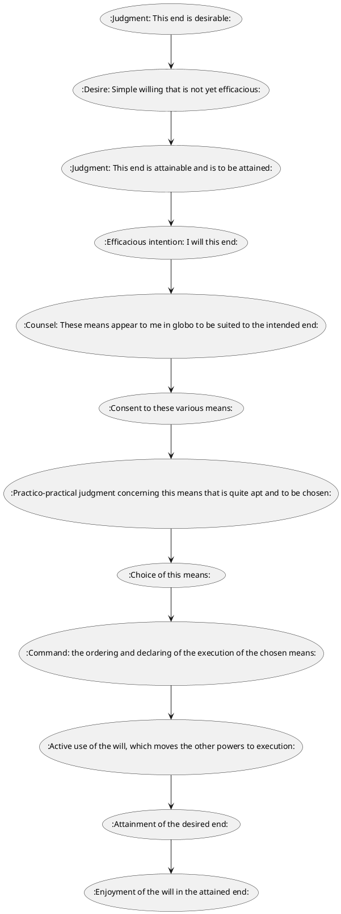

| Acts of the intellect                               | I. ACTS CONCERNED WITH THE END           | Acts of the will                                 |
|-----------------------------------------------------|------------------------------------------|--------------------------------------------------|
| (1) Judgment: This end is desirable.                | Order of intention                       | (2) Desire (simple willing that is not yet efficacious). |
| (3) Judgment: This end is attainable and is to be attained. |                                          | (4) Efficacious intention: I will this end.      |
| (5) Counsel: These means appear to me in globo to be suited to the intended end. |                                          | (6) Consent to these various means.              |
| (7) Practico-practical judgment concerning this means that is quite apt and to be chosen. | II. ACTS CONCERNED WITH THE MEANS         | (8) Choice of this means.                        |
| (9) Command: the ordering and declaring of the execution of the chosen means. | A. Order of choice                       |                                                  |
| (11) Attainment of the desired end.                 | B. Order of execution                    | (10) Active use of the will, which moves the other powers to execution. |
|                                                     |                                          | (12) Enjoyment of the will in the attained end.  |

For a Mermaid flow diagram, you can use the following code snippet in your Markdown file:

```mermaid
graph LR	
    1(Judgment: This end is desirable) --> 2(Desire: Simple willing that is not yet efficacious)
    2 --> 3(Judgment: This end is attainable and is to be attained)
    3 --> 4(Efficacious intention: I will this end)
    4 --> 5(Counsel: These means appear to me in globo to be suited to the intended end)
    5 --> 6(Consent to these various means)
    6 --> 7(Practico-practical judgment concerning this means that is quite apt and to be chosen)
    7 --> 8(Choice of this means)
    8 --> 9(Command: the ordering and declaring of the execution of the chosen means)
    9 --> 10(Active use of the will, which moves the other powers to execution)
    10 --> 11(Attainment of the desired end)
    11 --> 12(Enjoyment of the will in the attained end)
```

For a PlantUML diagram, you can use the following code snippet:

You'll need to ensure that your Markdown editor or viewer supports Mermaid and PlantUML diagrams for these to render correctly.